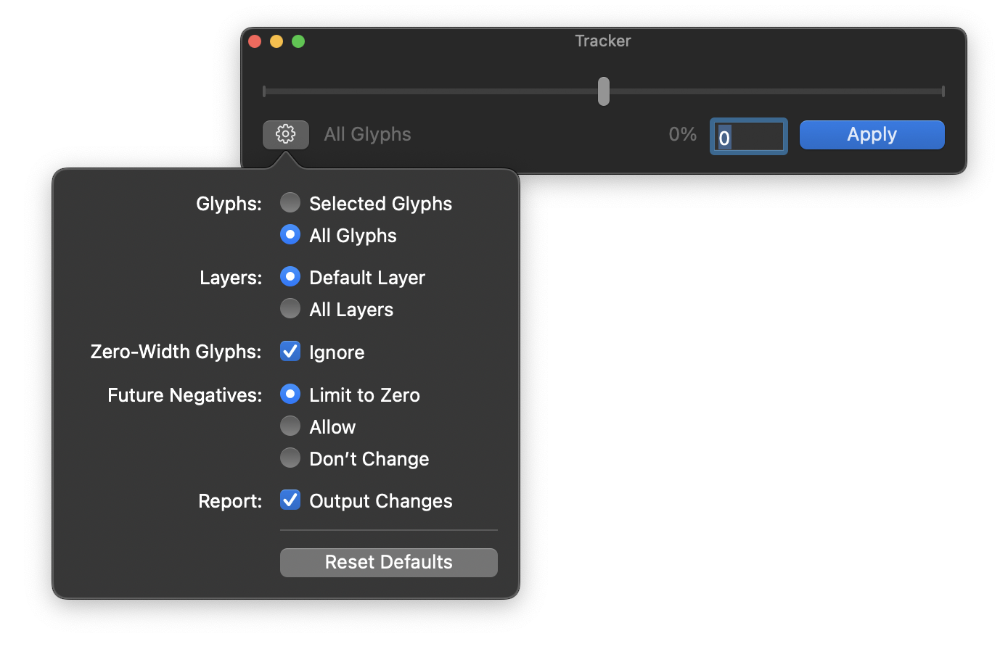

# Tracker
A simple RoboFont extension for changing overall spacing inside your UFO. Like a typographer changes tracking, but baked into the font instead.


Initially written November 2024

## How to use

1. Open a Space Center and preview some text.
2. Open Tracker.
3. Move the slider until the tracking looks good.

	> Note: At this stage, Tracker is simply changing the preview of the tracking in your font. Nothing in your font has actually been changed.

4. Once the spacing looks good, and you would like to change the font itself, click **Apply**. 

## Settings



### Glyphs

Choose between all glyphs and selected glyphs. Choose **All Glyphs** if you would like to change the tracking of the entire font. Choose **Selected Glyphs** if you would only like to change the spacing of selected glyphs (i.e. uppercase only, figures only, etc.).

> Note: Tracker will only correct the component positioning if the component’s base glyph is contained in the glyph set in question. That means that if you do a bunch of tracking operations on different subsets of glyphs, you may have undesired results with components.

### Layers

Choose between all layers and default layer. Choose **All Layers** if you would like to change the tracking of every layer in your UFO. Choose **Default Layer** if you would only like to change the spacing of the UFO’s main design layer and keep the other layers unaffected.

### Zero-Width Glyphs

Often, fonts have glyphs with zero width, such as combining accents for diacritics. If you would like to keep the width of these glyphs as-is, then you can check **Ignore**.

### Future Negatives

Let’s say some of your glyphs are 50 units wide, and you want to track your font -60 units. Are you okay with some of your glyphs having a width of -10 units? This setting allows you to control this. Here are your choices:

**Limit to Zero:** You’re okay with decreasing the tracking of this glyph, but only until it hits zero-width. You want to avoid negative widths.

**Allow:** You’re okay with negative widths. Brute force!

**Don’t Change:** You want to handle the spacing of these glyphs yourself. You want to leave these glyphs unaffected by Tracker.


## Behind the scenes

- Tracker works with font units. Typesetting apps don’t always use that measurement. Let’s say you have your font test-installed and working in Figma. You like how 3% tracking looks in Figma, and you want that to be your font’s default spacing. The percentage is of your font’s “em.” Most fonts have 1000 units per em; let’s say yours does too. 

	> 3% = `0.03 * 1000upm` = **30**
	
	So now you know to apply 30 units of tracking to your font using Tracker. Luckily, Tracker provides a readout that tells you what percentage you are tracking your font, based on the units you input.

- Tracker will force you to track with an even number. This is because it encourages you to add an equal amount of space to each sidebearing of each glyph. Let’s say you would like to add 1 unit of tracking. Which sidebearing will you add the unit to? Now you see the problem.
- Components are tricky because they’re just references to glyphs inside other glyphs and each glyph has their own spacing situation... Well, Tracker has some *state-of-the-art* math inside that preserves your relative component positioning as best as possible, regardless of whether components are stretch, squished, rotated, flipped, etc. 

	> Note: Tracker will only correct the component positioning if the component’s base glyph is contained in the glyph set in question. That means that if you do a bunch of tracking operations on different subsets of glyphs, you may have undesired results with components.
 
## API

If you have Tracker installed, a generalized `track()` method is added to `RFont` objects.

```python
BaseFont.track(
	tracking_value,
	glyph_set=None,
	all_layers=True,
	ignore_zero_width=True,
	future_negative_width="allow negatives",
	report=False
)
```
Apply sidebearing-preserving tracking to all or a subset of glyphs in a font.

### Example Scripts

```python
f = CurrentFont()
f.track(122)
```

```python
f = CurrentFont()
# Subtract 100 units from basic caps, in default layer only. No negative widths.
f.track(
    -100, 
    glyph_set=["A", "B", "C", "D", "E", "F", "G", "H", "I", "J", "K", "L", "M", "N", "O", "P", "Q", "R", "S", "T", "U", "V", "W", "X", "Y", "Z"],
	all_layers=False,
	future_negative_width="limit to zero",
)
```

### Arguments

`tracking_value`

Tracking in font units. Provide as an even integer. Each glyph gets + half on RSB and + half on LSB.

`glyph_set`

Names of glyphs to track. Provide as list/set of glyph names or `None`. `None` uses all glyphs in each processed layer.

`all_layers`

Boolean. `True` processes every layer in the font. `False` processes only the default layer.

`ignore_zero_width`

Boolean. Skip glyphs with width 0 (e.g. combining accents) when `True`.

`future_negative_width`

Behavior if the requested tracking would push a glyph’s width below zero. Provide as one of the following strings:

- `"allow negatives"` (default) Proceed even if width becomes negative.

- `"limit to zero"` Clamp current glyph’s subtracted tracking to the largest change that keeps width at 0.

- `"don’t change"` Skip that glyph.

`report`

Boolean. Print a short report of changes after completion.


## Acknowledgements

- Frederik Berlaen, for RoboFont
- Tal Leming, for EZUI & Susbcriber
- Connor Davenport, for the [snippet](https://github.com/ryanbugden/Tracker/issues/3#issuecomment-3408261462)
