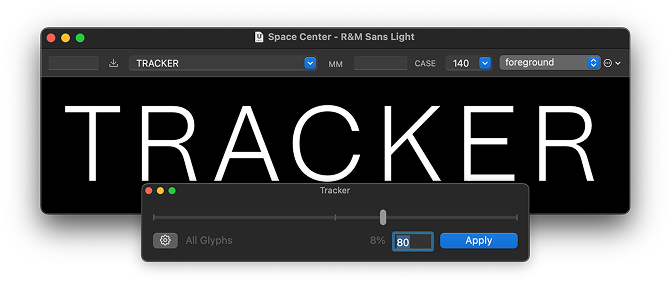

# Tracker
A simple RoboFont extension for changing overall spacing inside your UFO. Like a typographer changes tracking, but baked into the font instead.

Initially written November 2024

## How to use

1. Open a Space Center and preview some text.
2. Open Tracker.
3. Move the slider until the tracking looks good.

	> Note: At this stage, Tracker is simply changing the preview of the tracking in your font. Nothing in your font has actually been changed.

4. Once the spacing looks good, and you would like to change the font itself, click **Apply**. 

### Notes:

- Tracker will force you to track with an even number. This is because it encourages you to add an equal amount of space to each sidebearing of each glyph. Let’s say you would like to add 1 unit of tracking. Which sidebearing will you add the unit to? Now you see the problem.
- Components are tricky because they’re just references to glyphs inside other glyphs and each glyph has their own spacing situation... Well, Tracker has some *state-of-the-art* math inside that preserves your relative component positioning as best as possible, regardless of whether components are stretch, squished, rotated, flipped, etc.
- **Future features:**
	- Tracker currently ignores glyphs that have zero width. And if your tracking will result in a negative zero width, it will limit the tracking change to zero. These decisions are subjective, so I will implement a settings button at some point to allow you to control this.
	- A simple API that will enable you to script tracking in a font. Something like `tracker.track_font()`.
	- Should “Selected Glyphs” be an option? Spacing changes currently apply to the whole UFO.
		- This is because component references in a UFO can create an intricate web of dependencies, even with regard to spacing. 
		- Allowing Tracker to change a limited selection of glyphs is possible, but it has a lot more potential to be destructive, as component position correction will only happen if the component’s base glyph is amidst the glyphs in question. 
		- Also, the Space Center preview happens to the whole font, so it might give the wrong idea when you only intend to change a limited selection of glyphs. 
		- Let me know what you think—I might add this anyway.

## Acknowledgements

- RoboFont, Frederik Berlaen
- EZUI + Susbcriber, Tal Leming
